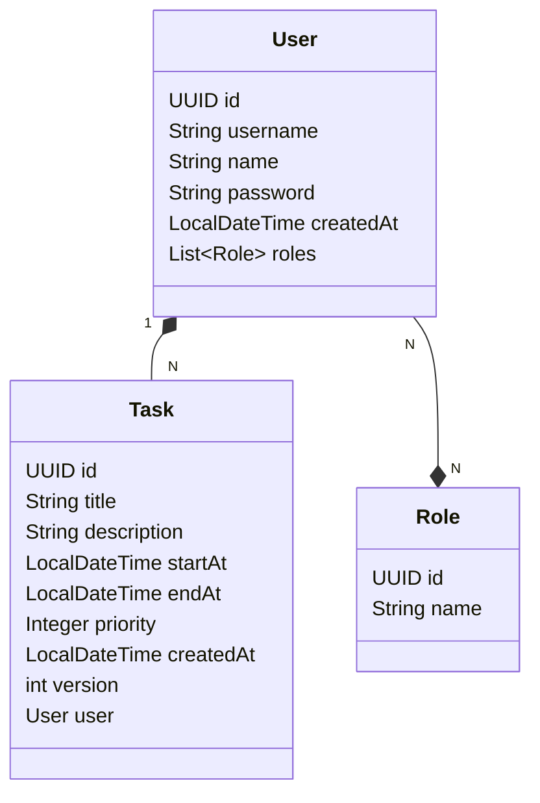

<div align="center">
     
</div>


# To-Do List Services

Esta API foi desenvolvida em Spring Boot para gerenciar tarefas em um aplicativo To-Do List. Ela oferece endpoints seguros e eficientes para operações CRUD, permitindo a criação, leitura, atualização e exclusão de tarefas.


## 🛠 Tecnologias

As seguintes ferramentas foram usadas na construção do projeto:

- [Java](https://www.java.com/pt-BR/)
- [Spring boot](https://spring.io/projects/spring-boot)
- [Lombok](https://projectlombok.org/)
- [H2 Database](https://www.h2database.com/html/main.html)
- [Bcrypt](https://github.com/patrickfav/bcrypt)
- [JWT](https://github.com/auth0/java-jwt)

## 🧾 Diagrama de Classes



## 🚀 Como executar a API
### Pré-requisitos
Antes de começar, você vai precisar ter instalado em sua máquina as seguintes ferramentas: **Java 17+**, **Gradle 8+**. Além disto é bom ter um editor para trabalhar com o código como [**VSCode**](https://code.visualstudio.com/)
<br></br>
```shell
# Clone este repositório
git clone https://github.com/matheusjuan1/todolist-services

# Acesse a pasta do projeto no terminal/cmd
cd todolist-services

# Execute a aplicação (escolha o comando conforme seu sistema operacional)

# Para Linux/macOS:
./gradlew bootRun

# Para Windows:
gradlew.bat bootRun

# O servidor inciará na porta:8080 - acesse http://localhost:8080 
```
## 🗂️ Documentação
Você pode acessar a documentação interativa da API utilizando o [Swagger UI](https://swagger.io/tools/swagger-ui/).
#### Passos
1. Certifique-se de que a API está em execução localmente
2. Abra seu navegador e acesse a URL:
     ```
     http://localhost:8080/swagger-ui.html
     ```
Isso irá exibir a interface gráfica do [Swagger](https://swagger.io/tools/swagger-ui/), onde você pode visualizar todos os endpoints da API, suas descrições e realizar chamadas diretamente a partir da interface.

## 📝 Licença

Este projeto está sob a licença MIT.

Feito por Matheus Juan. [Entre em contato](https://www.linkedin.com/in/matheus-ferreira-a84046186/)

<div align="center">
     
</div>
